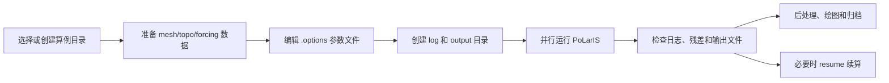

# 运行流程

PoLarIS 的一次实验通常围绕一个算例目录展开。目录中包含网格、地形/强迫 NetCDF、`.options` 参数文件，以及运行时生成的 `log/`、`output/` 和续算记录。



## 1. 选择算例目录

源码中的冰盖算例位于：

```text
ice-sheet/
  EISMINT-II/
  ISMIP-HOM/
  MISMIP/
  NEGIS/
  options/
  src/
```

典型算例目录包含：

```text
case/
  ins-flow.options
  mesh.nc
  testC.nc
  log/
  output/
```

如果新建真实冰盖实验，建议使用如下结构：

```text
experiments/
  antarctica_baseline/
    ins-flow.options
    input/
      mesh.nc
      topo.nc
      forcing.nc
    log/
    output/
    README.md
```

如果输入文件放在 `input/` 下，参数文件中的路径也要相应写成：

```text
-mesh_file input/mesh.nc
-topo_file input/topo.nc
-forcing_file input/forcing.nc
```

## 2. 准备输入文件

至少需要：

```text
-mesh_file mesh.nc
-topo_file testC.nc
```

如果使用独立强迫文件，再添加：

```text
-forcing_file forcing.nc
```

准备阶段建议检查：

- 网格文件是否能被当前程序读取；
- 地形文件中是否包含冰厚、表面、基岩、温度、摩擦和掩膜等字段；
- 强迫变量是否使用模型支持的变量名；
- 瞬态强迫是否包含 `time(time)`；
- 时间轴是否覆盖 `-time_start` 到 `-time_end`；
- 冰盖算例是否使用 `-partitioner user`。

## 3. 编辑参数文件

可从已有示例复制：

```text
ice-sheet/EISMINT-II/ins-flow.options
ice-sheet/ISMIP-HOM/ins-flow.options
ice-sheet/options/ins-flow.options
```

一个最小的一阶近似运行配置可以从下面开始：

```text
-verbosity 2
-log_file log/log
-partitioner user

-mesh_file mesh.nc
-topo_file testC.nc
-periodicity 0
+update_bdry_type
-pre_refines 0

-core_type fo
-utype P1
-ptype P1
-T_type P2
+use_prism_elem

+enclosed_flow
+pin_node
-sliding_law 1

+solve_temp
-solve_height
-init_temp_type -1
-height_scheme 3

+start_const_vis
+non_linear
-non_tol 1e-6
-max_non_step0 40
-max_non_step 4
-min_non_step 3
-newton_start 15

-theta 1.0
-dt 0.0833333333333333
-time_start 2014.0
-time_end 2025.0
-max_time_step 1
-step_span 1
+use_nc_forcing_time

+output_vtk
+output_nc
```

如果只做稳态或单步测试，可以缩短时间设置：

```text
-max_time_step 1
-step_span 1
```

## 4. 创建运行目录

运行前确保日志和输出目录存在：

```text
log/
output/
```

如果程序不能自动创建目录，缺少这些目录会导致日志或输出写入失败。

## 5. 运行模型

实际命令取决于编译后的可执行文件名。一般形式是：

```text
mpirun -np <进程数> <PoLarIS可执行文件> -options_file ins-flow.options
```

如果在算例目录中运行，示例形式为：

```text
mpirun -np 4 ../src/ins -options_file ins-flow.options
```

也可以在命令行覆盖参数文件中的某些设置，例如：

```text
mpirun -np 4 ../src/ins -options_file ins-flow.options -time_end 2020.0 -dt 0.0833333333333333
```

批处理系统上可把上述命令写入 `bsub.sh` 或其他作业脚本。

## 6. 检查日志

首先查看：

```text
log/log
```

重点检查：

- 输入文件是否成功打开；
- 网格和分区是否正常；
- 边界类型是否更新；
- 非线性迭代是否达到 `-non_tol`；
- 线性求解是否达到设定残差；
- 时间步是否推进到预期时间；
- 是否有 NaN、发散、内存不足或文件写入错误。

如果 FO 线性求解收敛不好，可以先检查 `fo_ksp_rtol`、`fo_ksp_max_it`、ASM overlap 和 MUMPS 设置。源码文档中提示，FO 求解器常需要比 Stokes 更严格的线性残差标准。

## 7. 检查输出

常见输出包括：

| 输出 | 触发参数 | 说明 |
| --- | --- | --- |
| `ice_*.vtk` | `+output_vtk` | 三维速度、温度等场，可用 ParaView 查看 |
| `*.nc` | `+output_nc` | 模型状态 NetCDF |
| ISMIP 风格 NetCDF | `+output_ismip_nc` | 面向 ISMIP 诊断提交 |
| `non*.vtk` | `+output_non_iter` | 非线性迭代过程 |
| `beta.vtk` | `+output_beta` | 底部摩擦系数 |
| `melt.vtk` | `+output_melt` | 融化率 |
| `GL_*.vtk` | `+output_grounding_line` | 接地线诊断 |
| `fv-vert_*.vtk` | `+output_fv_vert` | 厚度更新相关诊断 |

如果使用 `-outputTimeScheme 1`，输出文件名会尽量按实际模型年份组织，例如：

```text
ice_2014.vtk
ice_2014.nc
ismip_2d_2014.nc
```

## 8. 续算

PoLarIS 支持保存和读取续算数据：

```text
+record
+resume
```

常用方式：

1. 第一次运行时启用 `+record`，保存可续算状态；
2. 中断或需要继续时启用 `+resume`；
3. 如果只想保留最近状态，可使用 `+record_recent`。

续算时不要随意更换网格、自由度类型或关键物理参数，否则旧记录可能和新配置不一致。

## 9. 后处理和归档

运行完成后建议归档：

- 使用的 `ins-flow.options`；
- 输入数据版本和来源；
- 编译版本或 Git commit；
- `log/` 中的主要日志；
- `output/` 中关键 VTK/NetCDF 文件；
- 后处理脚本和图件；
- 实验说明 `README.md`。

这样后续可以把实验整理到网站的区域页面或案例页面中。
