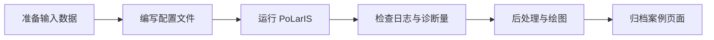

# 运行流程

一个完整的 PoLarIS 实验通常包括数据准备、配置生成、模型运行、诊断检查和结果归档。


```mermaid
flowchart LR
  A["准备输入数据"] --> B["编写配置文件"]
  B --> C["运行 PoLarIS"]
  C --> D["检查日志与诊断量"]
  D --> E["后处理与绘图"]
  E --> F["归档案例页面"]
```

## 推荐目录组织

```text
experiments/
  greenland_ismip6/
    config.yml
    input/
    output/
    figures/
    README.md
```
