# 引言

极地冰盖（图 1.1）对全球热量平衡和海平面上升具有重要的影响。IPCC 第六次评估报告指出，气候变化评估中最大的不确定性之一来自对极地冰盖对未来海平面上升贡献量的估计。格陵兰冰盖物质损失对 20 世纪全球海平面变化贡献了 29%，南极冰盖物质损失区域差异性大，其中西南极冰盖底部由于受到海洋环流影响，融化速率相对较快。此外，东南极尤其是威尔克斯盆地（Wilkes Basin）也发现潜在的不稳定性。
 
 <div align="center">

<table>
<tr>
<td align="center">
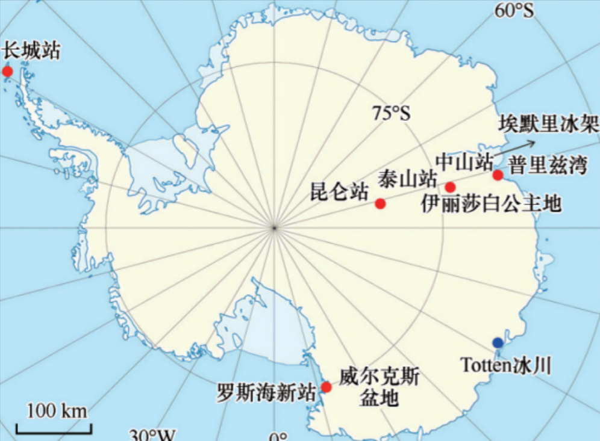<br>
<b>(a) 南极冰盖</b>
</td>

<td align="center">
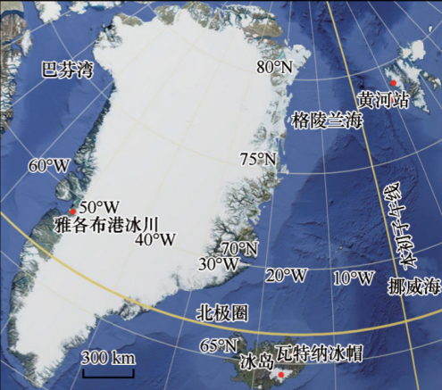<br>
<b>(b) 北极的格陵兰冰盖</b>
</td>
</tr>
</table>

<b>图1.1：</b>中标注了我国建立的台站（长城站、中山站、昆仑站、泰山站、罗斯海新站、黄河站）以及本文提到的一些研究区域或冰川位置

</div>

## 国内外研究进展

由于极地冰盖气候恶劣、难以接近，评估当前极地冰盖变化的主要手段是基于遥感监测，在部分区域结合野外实地测量。遥
感技术可以对冰盖实现全覆盖、连续性监测。地面实地测量难以大范围实施，但是可以更精确地探测冰盖内部构造和底部地形等关键物
理信息。遥感技术和地面实地测量等多源观测为研究极地冰盖变化提供了必备的数据资料（表<a href="#table:1" data-reference-type="ref"
data-reference="table:1">1.2</a>）。

<p align="center">
  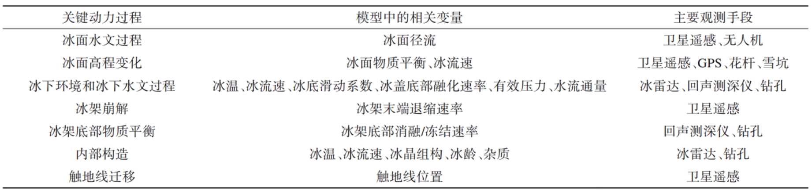<br><br>
   <b>图1.2：</b>冰盖关键动力过程、模型中的相关变量和主要观测手段。
</p>

基于多源观测数据作为模式边界条件和外部驱动，可以通过数值求解冰流动力学模型，详细描述
冰流的运动或预测冰盖的未来演化。冰盖数值模拟通常包括两种：一种是诊断模拟(diagnostic
modeling)，
用以诊断冰盖在稳态假设和特定边界条件及参数下的动态平衡状态；也可以用来测试冰盖对某些参数或边界条件
的敏感性以及微小变化对模型行为的影响，从而确定可能反馈机制的性质。诊断模型可用于提高对控制特定
冰流行为的参数的理解，或研究一般冰盖中一个或多个物理参数与边界条件的重要性。另一种是预估模
拟(prognostic
modeling)，用以描述冰盖运动的过程，通过调整模型并使其包括不同的物理过程，
以便更好地将模拟预估与实际情况相匹配，从而更好地预测冰盖的未来演变。预估模型既可直接用于预估
（或预测）冰盖的未来变化；也可用于重建冰盖的历史演化过程，从而有助于准确理解冰盖未来可能发生的变化。

如果要考虑到作用在冰上的所有应力分量，full-Stokes模型可能是最合适的工具。
在某些情形下忽略部分应力分量，可以得到简化近似方程。基于full-Stokes模型或者简化近似的冰流模型，
各国研究团队陆续研发了一些用于模拟冰盖状态或者预估其未来变化的数值求解方案，即冰流模式。
虽然我国在冰盖数值模拟方向的研究起步较晚，但是目前也形成了三个自主研发的冰流模式——多温型
陆地冰模型PoLIM、三维并行冰盖演化模型和高精度并行有限元冰盖模型。PoLIM为二维Blatter-Pattyn
高阶近似热力耦合冰流模型，以焓方法计算冰川热力场，包含冰下水文模型，采用有限差分方法求解计算。
张怀等开发了三维并行冰盖演化模型，进行了格陵兰冰盖的模拟演化。冷伟等研发的三维full-Stokes和高阶
近似冰盖模式求解器，使用了适用于大规模数值模拟的快速求解方法，并采用了保持局部质量守
恒的数值离散方法以提高计算精度，具有热力耦合和处理触地线进退过程的功能。

冰盖与大气、基岩、海洋接触，在边界处存在复杂的过程，包括冰盖表面物质平衡、冰盖水文过程、
冰下水热环境、冰架崩解、冰架底部消融和再冻结等（图<a href="#table:1" data-reference-type="ref"
data-reference="table:1">1.2</a>、图<a href="#fig:2" data-reference-type="ref"
data-reference="fig:2">1.3</a>）。
这些过程都会对冰流系统的物质平衡和稳定性产生重要的影响，是最近冰盖动力学研究领域的热点和难点。目前在理
论和观测上对上述关键动力过程和机制的认识都存在很大不足，严重制约了模式的发展和模拟结果的置信度。
尽管国际冰盖模式发展时间较长，但是其对上述过程多采取简单的参数化处理或者尚未考虑，其模拟结果
仍存在很大的不确定性。特别的，近年来开展的冰盖——海洋耦合模式比较计划，不同耦合模式对海洋强迫的
模拟结果差异很大。因此，模式的改进需要以冰盖典型区域长期持续的高精度精细测量作为基础支撑以提
升对冰盖关键过程和机制的理解。前些年已有数篇针对极地冰盖数值模拟的评述文章。近十余年来，我国冰川
学家在极地冰盖数值模拟方面产出了不少新的研究成果。

<p align="center">
  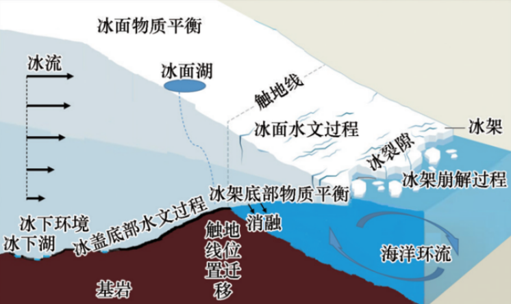<br><br>
  <b>图1.3：</b>冰盖关键动力过程示意图（本示意图的地形更适合西南极冰盖，而不适用于东南极和格陵兰冰盖大部分地区）。
</p>

开发冰盖动力学数值或解析模型的主要用途是为了更好地了解冰盖的流动行为以及它们如何对外部
    环境的强迫做出响应。这些模型通常基于一些描述冰流的基本定律或假设，经过简化后可以得到解析或数值解。
    冰盖动力学模型包括动力学方程和初始条件以及边界条件。动力学方程主要包括冰盖的质量、动量、能量守恒
    定律和本构方程Glen流动定律。目前最为完整的动力学方程是热力耦合的三维full-Stokes方程，
    它将描述质量、动量守恒的Stokes方程和描述能量守恒的热传导方程进行耦合，适用于各种情形的冰盖模拟。
    在Stokes方程的基础上进行不同程度的简化近似，可以得到静水压力近似(hydrostatic
    approximation)、 一阶近似(first order approximation)、浅冰盖近似(shallow
    ice approximation)、浅冰架近似 (shallow shelf
    approximation)等。在full-Stokes方程中忽略垂直切应力$`\tau_{zx}`$和$`\tau_{zy}`$
    方向的导数，可以得到静水压力近似。在静水压力近似基础上，忽略速度竖直分量的水平导数，即假设速度竖直分量
    $`v_z`$仅依赖于竖直坐标$`z`$和时间$`t`$，$`v_z=v_z(z,t)`$得到一阶近似。在一阶近似基础上进一步简化，把冰盖看
    作是平行底面的剪切流，水平切应力$`\tau_{xz}`$和$`\tau_{yz}`$对水平方向的动量平衡起到重要作用，忽
    略法向应力偏量和竖直切应力$`\tau_{xy}`$,可以得到浅冰盖近似模型；而如果应用在冰架上，假设冰架底面切应力
    为零，流速的水平分量不依赖于深度，即$`v_x=v_x(x,y,t),v_y=v_y(x,y,t)`$,则得到浅冰架近似模型。
    浅冰盖近似和浅冰架近似可以结合成混合模型(hybrid
    model)，应用到整个冰盖的模拟。

黏性系数是动力学方程的关键参数，直接影响着冰流的速度大小，并且敏感地依赖于冰温和冰晶组构等因素。
因此，热力耦合的动力学方程的模拟结果相对更接近实际情形。full-Stokes方程及其近似方程是建立在冰各向同性的假设之上，由于
实际冰盖冰晶组构各向异性等原因，冰流动力学方程中的重要参数（例如冰的黏性增强因子、冰底摩擦系数）可以通过求解反问题来反
演，使得表面冰流速的模拟值与观测值误差最小。原则上，对于full-Stokes
冰盖模型而言，随着计算机技术的发展使得完整应力分
布的充分计算已成为可能并得到逐步实现。但对于百年以上的积分，某些大陆尺度的冰盖演化模拟在数值计算上仍不可行。

技术上，冰盖动力学模型求解的空间域是基于地形数据建立的研究对象的数字高程模型。基于冰厚、
海平面高程和冰底高程数据，可以判断出冰盖触地部分和冰架部分。在研究区域的边界（冰面、冰底、冰崖、
侧面等）要给出合理的边界条件，主要包括：(1)冰面温度、表面物质平衡；(2)冰底触地部分的热力平衡方
程（包括地热通量等）、运动状态等；(3)冰盖底部的压融点温度和物质平衡等；(4)冰崖处的海水压强和崩
解过程等。其中，表面物质平衡和冰架底面物质平衡体现的是大气和海洋对冰盖作用的强迫场。冰盖表面物
质平衡的获取途径较多，包括实地测量、再分析资料和区域气候模式的模拟结果等。冰架底面物质平衡的直接
监测条件受限（主要是回声测深仪和钻孔），缺乏基础数据。以往和目前的研究多采用参数化方案或者
海洋模式的模拟结果进行估算。如何给出较为精确的冰架底面物质平衡是目前研究的主要难点之一。另外
，冰盖底部的运动状态很难监测，而且对冰下水热环境变化非常敏感等，具有较大的不确定性。以往研究中的
常用方法是在假定的滑动定律形式下通过数据同化反演底部滑动系数。冰崖处的崩解过程对南极冰盖的稳定性
非常重要，也是南极冰盖物质损失很大的不确定性来源。但是崩解过程如何在冰盖模型中精确地刻画是迄今尚未
较好解决的难题。在以往的冰盖模拟研究中常见的处理方式有：冰崖的位置保持固定，或者利用冰裂隙深度
、冰面径流、应变率、应力、冰厚等对崩解速率进行参数化。

冰盖模型的初始条件是确定起始时间冰盖的状态。如何得到符合冰盖实际情况的初始状态，即模式的
初始化，是一个研究难题。前两年国际专门针对模式初始化开展了模式比较计划initMIP。
常见的方法有长期
的预热模拟(spin-up)和基于数据同化方法的稳态模拟，即融合观测数据和数值模拟得到同化的模式参数和较为
接近实际情形的初始状态。同化的参数在预估冰盖未来演化状态中是否仍然适用，是有待商榷的问题。

根据基本物理定律而构造的用来模拟冰盖状态或者预估其未来变化的一套流体力学和热力学偏微
分方程组及其求解方案，称之为冰流模式。针对冰盖研发的冰流模式也称为冰盖模式。冰盖模式通过数值
求解带有初始条件和边界条件的物理模型，模拟冰盖的速度场、温度场、应力场等主要物理量的时空分布以
及冰盖形态和触地线位置的变化，从而有效地理解冰盖动力演化过程。冰盖模式计算的大致流程见图<a href="#fig:3" data-reference-type="ref"
data-reference="fig:3">1.4</a>。

<p align="center">
  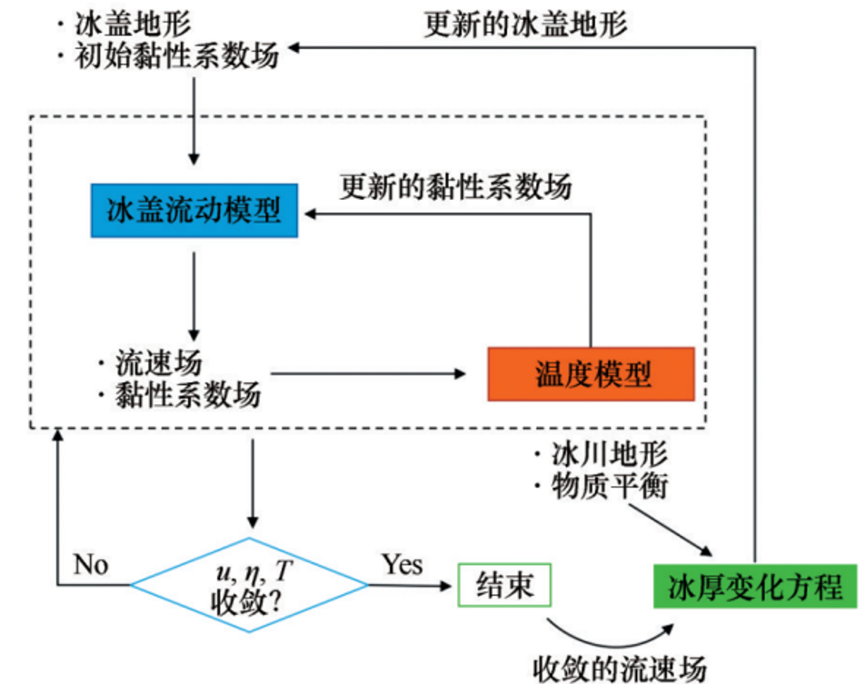<br><br>
  <b>图1.4：</b>冰川动力学数值模式计算流程
</p>

# POLARIS简介

PoLarIS是Polar Land Ice Simulator的缩写，读音为“北极星”的英文发音，意思
是“极地陆冰模拟器”
，主要面向地球三极陆冰（南北极冰盖和亚洲高山区冰川）的动力学模拟。

## 控制方程及边界条件

冰盖的动力学行为由具有非线性流变学的不可压粘性流体的Stokes方程建模，即假
设非线性本构律。设$`[0,t_{\text{max}}]`$是我们感兴趣的时间段，$`\Omega_t`$表示冰盖占据
的三维空间区域，则有动量守恒方程：

$$
\nabla\cdot\sigma+\rho\mathbf{g}=0\quad\mathrm{in}\quad\Omega_t\times[0,t_{\max}],
\qquad(2.1)
$$


质量守恒方程：

$$
\nabla\cdot\mathbf{u}=0\quad\mathrm{in}\quad\Omega_t\times[0,t_{\max}],
\qquad(2.2)
$$

其中$`\mathbf{u}=(u_x,u_y,u_z)^T`$表示速度，$`\sigma`$表示全应力张量，$`\rho`$表示冰的
密度，$`\mathbf{g}=(0,0,-g)`$表示重力加速度。应力张量$`\sigma`$可以分解为剪切力$`\tau`$
和各向同性的压力$`p`$，即：

$$
    \sigma=\tau-p\mathbf{I}\quad\mathrm{or}\quad\sigma_{ij}=\tau_{ij}-p\delta_{ij},
\qquad(2.3)
$$

其中，$`p=-\frac13tr(\sigma)`$，$`\delta_{ij}`$是Kronecker记号。结合(<a href="#eq:1" data-reference-type="ref"
data-reference="eq:1">[eq:1]</a>)和(<a href="#eq:3" data-reference-type="ref"
data-reference="eq:3">[eq:3]</a>)式， 得到瞬时的动量守恒方程:

$$
    -\nabla\cdot\tau+\nabla p=\rho\mathbf{g}\quad\mathrm{in}\quad\Omega_t\times[0,t_{\max}].
    \qquad(2.4)
$$

应变率张量$`\dot{\varepsilon}_\mathbf{u}`$定义为：

$$
    \left(\dot{\varepsilon}_\mathbf{u}\right)_{ij}=\frac12{\left(\frac{\partial u_i}{\partial x_j}+\frac{\partial u_j}{\partial x_i}\right)}.
    \qquad(2.5)
$$

剪切力张量$`\tau`$和应变率张量$`\dot{\varepsilon}_\mathbf{u}`$之间的关系由非线性的Glen冰流本构律给出：

$$
    \tau=2\eta_\mathbf{u}\dot{\varepsilon}_\mathbf{u}
    \qquad(2.6)
$$

其中，

$$
    \eta_{\mathbf{u}} = \frac{1}{2}A^{-\frac{1}{n}}\dot{\varepsilon}_e^{\frac{1-n}{n}},
    \qquad(2.7)
$$

其中，

$$
    \dot{\varepsilon}_e = \left(\frac{1}{2}\dot{\varepsilon}_\mathbf{u}:\dot{\varepsilon}_\mathbf{u}\right)^{\frac{1}{2}},
    \qquad(2.8)
$$

变形速率系数$`A`$通常与温度、压力和冰的其他性质有关，在Zhang et
al.\[2001\]的文献中，假设$`A`$只依赖于温度 且
``` math
A = A_0\exp\left(-\frac{Q}{RT}\right).
```
其中$`A_0`$是通常用作调谐参数的经验流动常数，$`Q`$表示蠕变的活化能，$`R`$表示通用气体常数，并且$`T`$表示以开尔文测量的绝对温度，
我们假设$`A`$是在整个空间一致的常数。

在冰盖的表面，对$`\Gamma_s`$施加边界条件

$$
    \sigma\cdot\mathbf{n}=-p_{atm}\cdot\mathbf{n}\quad\text{on}\quad\Gamma_s,
     \qquad(2.9)
$$

其中，$`\mathbf{n}`$表示冰盖边界的外法线单位向量，$`p_{atm}`$表示大气压。因为大气压力相对于冰内的压力可以忽略不计，所以我们做了标准简化，$`p_{atm}=0`$.

沿着横向边界$`\Gamma_l`$,我们施加三种类型的边界条件之一。如(<a href="#eq:4" data-reference-type="ref"
data-reference="eq:4">[eq:4]</a>)、或零速度条件$`\mathbf{u}=0`$或周期
性边界条件。这种灵活性使得该模型不仅可以模拟真实的冰盖，还可以将我们的方法应用于使用后两种非物理边界条件的基准算例。
在我们当前的模型和实验中，我们没有考虑横向边界部分淹没在水中的情况，例如在冰-海洋边界处发生的情况。

冰盖的底部可以分解成两部分：$`\Gamma_{b,fix}`$表示冰盖固定在底部基岩上的部分，$`\Gamma_{b,sld}`$表示冰盖底部可以滑动的部分。在底部边界的固定部分，我们施加零速度边界条件
``` math
\mathbf{u}=0\quad\text{on}\quad\Gamma_{b,fix}.
```
这蕴含了无穿透条件$`\mathbf{u}\cdot\mathbf{n}=0`$和无滑动条件$`\mathbf{u}\times\mathbf{n}=0`$.
在底部边界的滑动部分，我们施加Rayleigh摩擦边界条件

$$
    \mathbf{u}\cdot\mathbf{n}=0\quad\text{and}\quad\mathbf{n}\cdot\sigma\cdot\mathbf{t}=-\beta^2\mathbf{u}\cdot\mathbf{t}\quad\text{on}\quad\Gamma_{b,sld}.
    \qquad(2.10)
$$

考虑Rayleigh摩擦定律主要是为了与基准实验进行比较。参数$`\beta^2`$表示给定的滑动系数，$`\mathbf{t}`$表示与底面相切
的任何单位向量。(<a href="#eq:5" data-reference-type="ref"
data-reference="eq:5">[eq:5]</a>)中的负号意味着摩擦力的方向与速度的方向相反。

## 变分问题

这里介绍Stokes方程的有限元求解，有限元离散建立在对微分方程的变分问题上。这一节，我们推导施加适当边界条件的Stokes方程组
(<a href="#eq:2" data-reference-type="ref"
data-reference="eq:2">[eq:2]</a>),(<a href="#eq:6" data-reference-type="ref"
data-reference="eq:6">[eq:6]</a>).用$`L^2(\Omega_t)`$表示$`\Omega_t`$上的平方可积函数空间，$`\mathbf{H}^1(\Omega_t)`$表示每个分量都是
$`H^1(\Omega_t)`$的向量函数空间，即每个分量都是$`L^2(\Omega_t)`$,且所有一阶导数也都是$`L^2(\Omega_t)`$的。

对(<a href="#eq:6" data-reference-type="ref"
data-reference="eq:6">[eq:6]</a>)两边同时乘测试函数$`\mathbf{v}\in\mathbf{H}^1(\Omega_t)`$,然后在$`\Omega_t`$上积分，由Green公式有：

$$
    \int_{\Omega_t}\tau:\nabla\mathbf{v}d\mathbf{x}-\int_{\Omega_t}p\nabla\cdot\mathbf{v}d\mathbf{x}-
    \int_{\Gamma}\mathbf{n}\cdot\sigma\cdot\mathbf{v}ds = \rho\int_{\Omega_t}\mathbf{g}\cdot\mathbf{v}d\mathbf{x}.
    \qquad(2.11)
$$

其中，$`\Gamma=\Gamma_s\cup\Gamma_b\cup\Gamma_l,\quad\tau:\nabla\mathbf{v}`$表示张量$`\tau`$和$`\nabla\mathbf{v}`$
对应元素相乘再求和。我们使用Einstein求和记号，即重复指标表示求和，
并记$`v_{i,j}=\frac{\partial v_i}{\partial x_j}`$,
则$`\tau:\nabla\mathbf{v}=\tau_{ij}v_{i,j}`$.由应力张量$`\tau`$的对称性，
我们有$`\tau_{ij}v_{i,j}=\tau_{ji}v_{j,i}=\tau_{ij}v_{j,i}`$. 所以有

$$
\tau_{ij}v_{i,j}=\frac{1}{2}\tau_{ij}(v_{i,j}+v_{j,i})=\tau_{ij}(\dot{\varepsilon}_{\mathbf{v}})_{ij}=2\eta_{\mathbf{u}}(\dot{\varepsilon}_{\mathbf{u}})_{ij}(\dot{\varepsilon}_{\mathbf{v}})_{ij}.
$$

因此有：

$$
    \int_{\Omega_t}\tau:\nabla\mathbf{v}d\mathbf{x} = \int_{\Omega_t}2\eta_{\mathbf{u}}\dot{\varepsilon}_{\mathbf{u}}:\dot{\varepsilon}_{\mathbf{v}}d\mathbf{x}.
    \qquad(2.12)
$$

在(<a href="#eq:4" data-reference-type="ref"
data-reference="eq:4">[eq:4]</a>)中我们假设$`p_{atm}=0`$,因此有

$$
    \int_{\Gamma_s}\mathbf{n}\cdot\sigma\cdot\mathbf{v}ds = 0.
    \qquad(2.13)
$$

若在$`\Gamma_l`$上施加边界条件(<a href="#eq:4" data-reference-type="ref"
data-reference="eq:4">[eq:4]</a>),则也有

$$
    \int_{\Gamma_l}\mathbf{n}\cdot\sigma\cdot\mathbf{v}ds = 0.
    \qquad(2.14)
$$

若在$`\Gamma_l`$上施加周期边界条件，则我们要求测试函数$`\mathbf{v}`$也是周期的，则(<a href="#eq:7" data-reference-type="ref"
data-reference="eq:7">[eq:7]</a>)依然成立。若在$`\Gamma_l`$上施加零速度边界条件，
即要求$`\mathbf{v}=0\quad\text{on}\quad\Gamma_l`$,则(<a href="#eq:7" data-reference-type="ref"
data-reference="eq:7">[eq:7]</a>)依然成立。
在无滑动边界$`\Gamma_{b,fix}`$，我们要求测试函数满足$`\mathbf{v}=0`$,因此有

$$
    \int_{\Gamma_{b,fix}}\mathbf{n}\cdot\sigma\cdot\mathbf{v}ds = 0.
    \qquad(2.15)
$$

在滑动边界$`\Gamma_{b,sld}`$上，因为$`\mathbf{u}\cdot\mathbf{n}=0`$,因此我们要求测试函数满足$`\mathbf{v}\cdot\mathbf{n}=0`$.
结合摩擦定律(<a href="#eq:5" data-reference-type="ref"
data-reference="eq:5">[eq:5]</a>)，我们有

$$
    \int_{\Gamma_{b,sld}}\mathbf{n}\cdot\sigma\cdot\mathbf{v}ds = -\int_{\Gamma_{b,fix}}\beta^2\mathbf{u}\cdot\mathbf{v}ds.
    \qquad(2.16)
$$

记

$$
\tilde{\mathbf{H}}(\Omega_t)=\{\mathbf{u}\in\mathbf{H}^1(\Omega_t):\mathbf{u}\vert_{\Gamma_l\cup\Gamma_{b,fix}}=0,(\mathbf{u}\cdot\mathbf{n})\vert_{\Gamma_{b,sld}}=0\}.
$$

注意到$`\tilde{\mathbf{H}}(\Omega_t)`$中的函数在指定边界上满足齐次边界条件，
把(<a href="#eq:8" data-reference-type="ref"
data-reference="eq:8">[eq:8]</a>)到(<a href="#eq:9" data-reference-type="ref"
data-reference="eq:9">[eq:9]</a>)代入(<a href="#eq:10" data-reference-type="ref"
data-reference="eq:10">[eq:10]</a>),我们就得到Stokes方程组的弱形式：
求解$`\mathbf{u}\in\tilde{\mathbf{H}}(\Omega_t)`$和$`p\in L^2(\Omega_t)`$,使得

对任意$`\mathbf{v}\in\tilde{\mathbf{H}}(\Omega_t)`$和$`q\in L^2(\Omega_t)`$成立。


$$ 
\begin{cases} 
\int_{\Omega_t}2\eta_{\mathbf{u}}\dot{\varepsilon}_{\mathbf{u}}:\dot{\varepsilon}_{\mathbf{v}}\,d\mathbf{x} 
+\int_{\Gamma_{b,fix}}\beta^2\mathbf{u}\cdot\mathbf{v}\,ds 
-\int_{\Omega_t}p\nabla\cdot\mathbf{v}\,d\mathbf{x} 
= \rho\int_{\Omega_t}\mathbf{g}\cdot\mathbf{v}\,d\mathbf{x} \\ 
-\int_{\Omega_t}q\nabla\cdot\mathbf{u}\,d\mathbf{x}=0 
\end{cases} 
\qquad(2.17)
$$


特别地，(<a href="#eq:11" data-reference-type="ref"
data-reference="eq:11">[eq:11]</a>)对应于零速度的横向边界。如果横向边界条件类似于(<a href="#eq:4" data-reference-type="ref"
data-reference="eq:4">[eq:4]</a>)，且$`p_{atm}=0`$,则$`\tilde{\mathbf{H}}(\Omega_t)`$
中的函数在$`\Gamma_l`$上为$`0`$的要求可以去掉。如果横向边界施加周期边界条件，则该要求被
替换为$`\tilde{\mathbf{H}}(\Omega_t)`$中的函数是周期的。

## 高阶精确有限元离散

这一节我们给出高阶精确有限元冰盖模型的具体描述。

### 四面体网格剖分

格陵兰岛和南极洲等冰盖的几何形状具有高度的各向异性，水平尺度与垂直尺度之比介于$`100:1`$到$`1000:1`$之间。
此外，在冰盖的大部分地区，水平方向变量的变化比垂直方向的变化小得多。因此，使用三维各向同性网格来离散各向异性的几何区域
会产生大量的网格点，更多的自由度是必要的。因此，当获得自由度相对较少的高阶精确解时，需要计算网格的各向异性。
除了冰盖边界附近和集中流动区域（例如冰流和出口冰川），解应该在水平方向上的变化比在垂直方向上的变化要慢得多。所以在
冰盖的大部分区域上，在水平方向上可以有较大的网格间距，因为在这些区域，解大多是缓慢变化的。另外需要注意的是，
缩放垂直坐标可以改善区域的纵横比，但是也会改变偏微分方程中的系数，因此物理纵横比在离散系统中仍然会出现，所以仅仅靠缩放
垂直坐标无法避免冰盖的高纵横比。

冰盖的高纵横比需要构造高纵横比的各向异性网格，为了避免生成低质量网格，在四面体网格生成中需要特殊的技巧。我们首先
对冰盖的水平尺度$`\Omega_H`$生成较高质量的二维三角形网格，记作$`\mathcal{Q}_h`$.然后，通过添加描述冰厚的
$`z`$坐标，将二维网格转换为覆盖整个冰盖区域的三角形网格，在冰盖顶面是三角形。然后，在竖直方向将每个三棱柱分成相同数量
的三棱柱，从而生成冰盖区域$`\Omega_t`$的完全三维、分层、棱柱形网格。最后，我们通过将每个棱柱单元分解
为三个四面体来获得冰盖的四面体网格。

### STOKES方程的有限元离散

记$`\mathcal{T}_h`$是上一节所讨论的冰盖区域四面体网格剖分，这里$`h`$表示对网格尺寸的一种刻画，比如说所有四面体单元
内切球直径的最大值。使用有限元空间$`P_{1,h}(\mathcal{T}_h)`$来逼近压强，$`P_{1,h}(\mathcal{T}_h)`$表示$`\mathcal{T}_h`$
上的分片线性多项式，即，在每个四面体单元上，函数形如$`a_0+a_1x+a_2y+a_3z`$,其中$`a_i,(i=0,1,2,3)`$是常数。这样的有限元函数
能够被它在四面体四个顶点的取值唯一确定。对速度分量的有限元逼近，我们选择更高阶的有限元空间$`P_{2,h}(\mathcal{T}_h)`$，在每个四面体单元上是二次函数，
即$`b_0+b_1x+b_2y+b_3z+b_4x^2+b_5y^2+b_6z^2+b_7xy+b_8yz+b_9zx`$,其中$`b_i,(i=0,\cdots,9)`$是常数，这样的函数能被它在四面体
四个顶点和六条棱的中点的取值唯一确定（图<a href="#fig:4" data-reference-type="ref"
data-reference="fig:4">2.1</a>）。

<p align="center">
  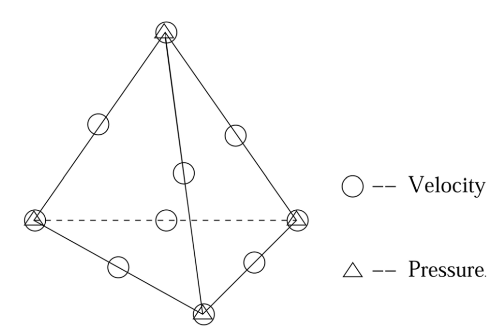<br><br>
  <b>图2.1：</b>Taylor-Hood元。
</p>

我们在横向边界条件为零速度边界时定义有限元空间：

$$
\tilde{\mathbf{P}}_{2,h}(\mathcal{T}_h)=\left\{
\mathbf{u}_h\in\left(P_{2,h}(\mathcal{T}_h)\right)^3:
\mathbf{u}_h\vert_{\Gamma_l\cup\Gamma_{b,fix}}=0,
(\mathbf{u}_h\cdot\mathbf{n})\vert_{\Gamma_{b,sld}}=0
\right\}
\qquad(2.18)
$$

因此，给定$`\Omega_t`$和$`\mathcal{T}_h`$,变分问题离散为：求解$`\mathbf{u}_h\in\tilde{\mathbf{P}}_{2,h}(\mathcal{T}_h)`$
和$`p_h\in P_{1,h}(\mathcal{T}_h)`$,使得

$$
\begin{cases}
\int_{\Omega_t}2\eta_{\mathbf{u}_h}\dot{\varepsilon}_{\mathbf{u}_h}:\dot{\varepsilon}_{\mathbf{v}_h}\,d\mathbf{x}
+\int_{\Gamma_{b,fix}}\beta^2\mathbf{u}_h\cdot\mathbf{v}_h\,ds
-\int_{\Omega_t}p_h\nabla\cdot\mathbf{v}_h\,d\mathbf{x}
=\rho\int_{\Omega_t}\mathbf{g}\cdot\mathbf{v}_h\,d\mathbf{x}\\
-\int_{\Omega_t}q_h\nabla\cdot\mathbf{u}_h\,d\mathbf{x}=0
\end{cases}
\qquad(2.19)
$$

对任意$`\mathbf{v}_h\in\tilde{\mathbf{P}}_{2,h}(\mathcal{T}_h)`$和$`q_h\in P_{1,h}(\mathcal{T}_h)`$成立。
因为$`\eta`$依赖于速度$`\mathbf{u}_h`$，因此(<a href="#eq:12" data-reference-type="ref"
data-reference="eq:12">[eq:12]</a>)是一个关于$`\mathbf{u}_h,p_h`$的非线性方程组。

不使用更高阶元有几个原因，比如解可能没有足够的光滑性来保证额外的精度。最重要的原因是，对于真实的冰盖
形状，边界条件是给定的一些离散点上的值，并且边界可能是极其不规则的。最后，缺乏对边界几何的
准确把握是决定求解精度的一个限制因素，因此高阶元不一定有用。

### PICARD线性化

我们使用Picard线性化算法来求解非线性系统(<a href="#eq:12" data-reference-type="ref"
data-reference="eq:12">[eq:12]</a>)，更复杂的线性化算法比如牛顿法或拟牛顿法通常会有更快的
收敛阶，但是这些方法需要更好的初值，即初值要足够靠近解，才能有更快的收敛速度，因此，这类方法通常以Picard线性化算法几步
后的解作为初值。

Picard线性化算法将依赖于速度的粘性系数$`\eta_{\mathbf{u}_h}`$滞后，在每一步Picard迭代中，$`\eta_{\mathbf{u}_h}`$
使用上一步迭代速度的近似解来估计。因此，给定速度初值$`\mathbf{u}_h^{(0)}`$（通常取为0，此时$`\eta_{\mathbf{u}_h}`$是一个正常数），
就可以通过不断求解线性方程组(<a href="#eq:13" data-reference-type="ref"
data-reference="eq:13">[eq:13]</a>)来获得速度$`\mathbf{u}_h^{(j)}`$和压强$`p_h^{(j)}`$.

$$
\begin{cases}
\int_{\Omega_t}2\eta_{\mathbf{u}_h^{(j-1)}}\dot{\varepsilon}_{\mathbf{u}_h^{(j)}}:\dot{\varepsilon}_{\mathbf{v}_h}\,d\mathbf{x}
+\int_{\Gamma_{b,fix}}\beta^2\mathbf{u}_h^{(j)}\cdot\mathbf{v}_h\,ds
-\int_{\Omega_t}p_h^{(j)}\nabla\cdot\mathbf{v}_h\,d\mathbf{x}
=\rho\int_{\Omega_t}\mathbf{g}\cdot\mathbf{v}_h\,d\mathbf{x}\\
-\int_{\Omega_t}q_h\nabla\cdot\mathbf{u}_h^{(j)}\,d\mathbf{x}=0
\end{cases}
\qquad(2.20)
$$

当残差满足条件时，迭代终止，并令$\mathbf{u}_h=\mathbf{u}_h^{(j)}$,通过简单的启发式渐近分析可知，Picard迭代是线性收敛的，
且压缩常数为$\frac{n-1}{n}$，其中$n$表示Glen流动定律中的指数。

在每一步Picard迭代中，线性有限元问题([eq:13])等价于一个对称鞍点问题：

$$
\begin{pmatrix}
F & B^T \\
B & 0
\end{pmatrix}
\begin{pmatrix}
\vec{\mathbf{u}} \\
\vec{p}
\end{pmatrix}=
\begin{pmatrix}
\vec{\mathbf{r}} \\
0
\end{pmatrix}
\qquad(2.21)
$$

其中$`\vec{\mathbf{u}},\vec{p}`$分别表示速度和压强的自由度。因此，接下来只需要求解线性方程组(<a href="#eq:14" data-reference-type="ref"
data-reference="eq:14">[eq:14]</a>).

### 滑动边界上无穿透条件的实现

在滑动边界$`\Gamma_{b,sld}`$上，我们需要实现无穿透条件$`\mathbf{u}\cdot\mathbf{n}=0`$.这个条件难以处理是因为
通常涉及速度的三个分量的线性组合。我们的处理方式是在滑动边界上每一个速度结点处进行坐标旋转：使得旋转后的坐标系有一个轴
与边界垂直，另外两个轴与边界相切。在这个新的坐标系中，无穿透边界条件是容易实现的。

用$`M`$表示所有速度结点的个数，则速度向量有$`3M`$个自由度。那么速度自由度$`\vec{\mathbf{u}}`$可以记作
``` math
\vec{\mathbf{u}}=\begin{pmatrix}\mathbf{u}_{1}\\ \vdots\\\mathbf{u}_{M}\end{pmatrix}
```
其中$`\mathbf{u}_i=(u_{ix},u_{iy},u_{iz})^T`$表示第$`i`$个速度结点的速度向量。滑动边界上的无穿透条件可以写成
``` math
\mathbf{u}_k\cdot\mathbf{n}_k=0,\quad\forall k\in\sigma_{b,sld}.
```
其中$`\sigma_{b,sld}`$表示滑动边界上的速度结点集合。

对任意的滑动边界上的自由度$`k\in\sigma_{b,sld}`$，我们有局部坐标系$`(\mathbf{n}_k,\mathbf{t}_k^1,\mathbf{t}_k^2)`$,
其中$`\mathbf{n}_k`$是单位外法向量，$`\mathbf{t}_k^1,\mathbf{t}_k^2`$是与边界相切的两个单位向量。记
``` math
T_k = (\mathbf{n}_k,\mathbf{t}_k^1,\mathbf{t}_k^2).
```
对于不在滑动边界上的自由度，定义$`T_k=I`$,其中$`I`$是$`3\times 3`$的单位矩阵。
则有
``` math
T=\begin{pmatrix}T_1&&\\&\ddots&\\&&T_M\end{pmatrix}.
```
且$`T`$是正交矩阵，把$`T`$插入到(<a href="#eq:14" data-reference-type="ref"
data-reference="eq:14">[eq:14]</a>)中，我们得到

$$
\begin{pmatrix}
\tilde{F} & \tilde{B}^T \\
\tilde{B} & 0
\end{pmatrix}
\begin{pmatrix}
\vec{\tilde{\mathbf{u}}} \\
\vec{p}
\end{pmatrix}=
\begin{pmatrix}
\vec{\tilde{\mathbf{r}}} \\
0
\end{pmatrix}
\qquad(2.22)
$$

其中，
``` math
\widetilde{F}=TFT^{T},\quad{\widetilde{B}}=BT^{T},\quad{\vec{\widetilde{\mathbf{u}}}}=T\vec{\mathbf{u}},\quad{\vec{\widetilde{\mathbf{r}}}}=T\vec{\mathbf{r}}.
```

现在把$`\vec{\widetilde{\mathbf{u}}}`$当作未知数，注意到
``` math
\vec{\widetilde{\mathbf{u}}}_{k}=\begin{pmatrix}\mathbf{n}_{k}\cdot\mathbf{u}_{k},
    \mathbf{t}_{k}^{1}\cdot\mathbf{u}_{k},
    \mathbf{t}_{k}^{2}\cdot\mathbf{u}_{k}\end{pmatrix}^{T}=
    \begin{pmatrix}0,\mathbf{t}_{k}^{1}\cdot\mathbf{u}_{k},
        \mathbf{t}_{k}^{2}\cdot\mathbf{u}_{k}\end{pmatrix}^{T}\quad\forall k{\in}\sigma_{b,sld}.
```
则对应于无穿透条件，只需令每个$`\vec{\widetilde{\mathbf{u}}}_{k}`$的第一个分量为0。因此，我们可以通过
求解(<a href="#eq:15" data-reference-type="ref"
data-reference="eq:15">[eq:15]</a>)得到$`\vec{\widetilde{\mathbf{u}}}`$,然后通过$`\vec{\mathbf{u}}=T^{T}\vec{\widetilde{\mathbf{u}}}`$
得到(<a href="#eq:14" data-reference-type="ref"
data-reference="eq:14">[eq:14]</a>)的解。

## 线性方程组求解

在数值模拟中为了获得较高的分辨率，从有限元离散中得到的大型稀疏线性方程组(<a href="#eq:15" data-reference-type="ref"
data-reference="eq:15">[eq:15]</a>)可能含有上百万个未知数。求解这样的
线性方程组对机器的算力和内存有很高的要求。以Krylov子空间方法（例如GMRES和CG）和预处理技巧（例如分块预优矩阵、多重网格
和不完全LU分解）为基础的迭代法只需要进行矩阵向量乘法的计算，因此最为常用。这里我们讨论并行化预处理迭代方法来求解线性方程组
(<a href="#eq:15" data-reference-type="ref"
data-reference="eq:15">[eq:15]</a>)

### 预处理器

考虑(<a href="#eq:15" data-reference-type="ref"
data-reference="eq:15">[eq:15]</a>)中的系数矩阵的分块分解，我们有

$$
\begin{pmatrix}
\widetilde{F} & \widetilde{B}^{\top} \\
\widetilde{B} & 0
\end{pmatrix}=
\begin{pmatrix}
I & 0 \\
\widetilde{B}\widetilde{F}^{-1} & I
\end{pmatrix}
\begin{pmatrix}
\widetilde{F} & \widetilde{B}^{\top} \\
0 & -S
\end{pmatrix}
\qquad(2.23)
$$

其中，$`S=\widetilde{B}\widetilde{F}^{-1}\widetilde{B}^{T}`$是Schur补。
``` math
\begin{pmatrix}\widetilde{F}&\widetilde{B}^{T}\\0&-S\end{pmatrix}
```
是一个很理想的预处理矩阵。实际上，使用该预优矩阵的GMRES方法最多两次迭代就能够收敛。
然而，把上式作为GMRES等迭代法的预优矩阵需要做该预优矩阵的逆和向量的乘法，该矩阵的逆为

$$
\begin{pmatrix}
\widetilde{F}^{-1}&\widetilde{F}^{-1}\widetilde{B}^TS^{-1}\\
0&-S^{-1}
\end{pmatrix}=
\begin{pmatrix}
\widetilde{F}^{-1}&0\\
0&I
\end{pmatrix}
\begin{pmatrix}
I&-\widetilde{B}^T\\
0&I
\end{pmatrix}
\begin{pmatrix}
I&0\\
0&-S^{-1}
\end{pmatrix}
\qquad(2.24)
$$

为了避免计算$`S^{-1}`$，我们使用加权质量矩阵$`M_{\eta}`$来替代$`S^{-1}`$，
``` math
(M_{\eta})_{i,j}=\int_{\Omega_{t}}(\eta_{\mathbf{u}_{h}^{(j-1)}})^{-1}\phi_{i}\phi_{j}d\mathbf{x}.
```
其中$`\phi_{i}`$是压强的基函数。因此，我们可以使用下面的矩阵

$$
\begin{pmatrix}
\widetilde{F}^{-1}&\widetilde{F}^{-1}\widetilde{B}^TM_\eta^{-1}\\
0&-M_\eta^{-1}
\end{pmatrix}=
\begin{pmatrix}
\widetilde{F}^{-1}&0\\
0&I
\end{pmatrix}
\begin{pmatrix}
I&-\widetilde{B}^T\\
0&I
\end{pmatrix}
\begin{pmatrix}
I&0\\
0&-M_\eta^{-1}
\end{pmatrix}
\qquad(2.25)
$$

作为预优矩阵的逆的一个近似。只需求解下面的预优线性方程组

$$
\begin{pmatrix}
\widetilde{F}&\widetilde{B}^T\\
\widetilde{B}&\boldsymbol{0}
\end{pmatrix}
\begin{pmatrix}
\widetilde{F}^{-1}&\widetilde{F}^{-1}\widetilde{B}^TM_\eta^{-1}\\
\boldsymbol{0}&-M_\eta^{-1}
\end{pmatrix}
\begin{pmatrix}
\vec{\widetilde{\mathbf{v}}}\\
\vec{q}
\end{pmatrix}=
\begin{pmatrix}
\vec{\widetilde{\mathbf{r}}}\\
0
\end{pmatrix}
\qquad(2.26)
$$

得到 $\vec{\widetilde{\mathbf{v}}},\vec{q}$ ,然后令

$$
\begin{pmatrix}\vec{\widetilde{\mathbf{u}}}\\\vec{p}\end{pmatrix}=
\begin{pmatrix}
\widetilde{F}^{-1}
&
\widetilde{F}^{-1}\widetilde{B}^{T}M_{\eta}^{-1}
\\
\mathbf{0}
&
-M_{\eta}^{-1}
\end{pmatrix}
\begin{pmatrix}
\vec{\widetilde{\mathbf{v}}}\\
\vec{q}
\end{pmatrix}
\qquad(2.27)
$$

### 并行化

并行计算通常使用分而治之的策略来解决大规模问题。我们采用区域分解方法(DDM)
用于系数
矩阵的构造和分布式计算机处理器上的局部预处理。首先将有限元网格划分为若干个子网格，在并行时每个处理器计算一个子网格。这样
就把整个区域上的问题分解为若干个相交子区域上的问题，而子区域上的问题会相对简单。我们只在水平方向使用“METIS”进行网格划分。

基于这种划分方法，我们并行化了(<a href="#eq:15" data-reference-type="ref"
data-reference="eq:15">[eq:15]</a>)的求解算法中的所有步骤，包括作为该算法一部分的两个GMRES
迭代中遇到的所有矩阵向量乘法。我们使用AMG预处理的GMRES方法作为求解(<a href="#eq:15" data-reference-type="ref"
data-reference="eq:15">[eq:15]</a>)的核心步骤。在我们的并行实现中使用了
并行AMG求解器*BoomerAMG*。BoomerAMG具有很大的灵活性，可以在各种并行粗化策略和不同的插值算子之间进行选择。

我们采用消息传递接口(MPI)作为并行环境。如上所述，在我们的实现中，我们在两个地方使用了GMRES方法
以及块预处理和AMG预处理技术来求解(<a href="#eq:16" data-reference-type="ref"
data-reference="eq:16">[eq:16]</a>);特别地，由于其可靠性和鲁棒性，我们在并行实现中采用了流行
的软件包PETSc.

# POLARIS的安装和应用

## 系统要求

PoLarIS在Linux环境中运行。对于比较小的模拟区域或者计算量较小的案例（如单条冰川），可以在本地笔记本电脑或
者台式机上面安装运行。对于较大的模拟区域和案例（如全南极和格陵兰冰盖），则需要在服务器上运行。对于本机计算平台的
设置，我们推荐使用Ubuntu Linux系统。以下是我们在Ubuntu
22.04.1系统中的安装和运行示例，电脑CPU架构是x86_64.

## 程序编译

### 并行软件安装

PoLarIS可以进行并行化计算，我们需要首先安装能够支持并行计算的软件包。
当然，如果计算量非常小，也可以选择不使用并行，仅仅用串行计算，即仅仅用1个核去计
算。在Ubuntu中，有两个常用的并行软件，mpich和openmpi，这两个软件都支持MPI并行
计算。用任何一个都可以，但需要保证和其他安装包没有冲突。比如，安装Paraview的时
候，Ubuntu会自动安装openmpi，但假如我们一开始是用mpich来安装POLARIS的，那么可
能就会有一些冲突，导致运行POLARIS的时候，并行模式工作不正常。因此，我们选择安
装openmpi：

```bash
$ sudo apt install libopenmpi-dev
```

apt是Ubuntu系统中的一个能自动安装软件的包管理器，会自动处理好一些相关的依赖关系。
安装好之后可以写一个最简单的程序来看看是否成功，比如我们可以编写一个`mpi_hello_word.c`文件

```bash
            /* The Parallel Hello World Program */
            #include <stdio.h> 
            #include <mpi.h> 
            
            int main(int argc, char **argv) {
                int node; 
                MPI_Init(&argc, &argv); 
                MPI_Comm_rank(MPI_COMM_WORLD, &node); 
                printf("Hello, world from node %d\n", node); 
                MPI_Finalize(); 
                return 0;
            }
```

用并行版本的C编译器mpicc去编译这个程序，

```bash
$ mpicc -o mpi_hello_world mpi_hello_world.c
```

得到一个可执行文件`mpi_hello_world`，随后就可以去运行这个可执行文件：

```bash
$ mpirun -np 4 ./mpi_hello_world
```

-np表示我们想用几个核去计算，这里我们用了4个核。`./`这个符号意思是当前目录。如果一切正常，就会看到这个结果

```bash
Hello World from Node 0
Hello World from Node 1
Hello World from Node 2
Hello World from Node 3
```

这就意味着每个核都运行了程序，并输出了结果，说明并行没有问题。

### 数值计算库安装

很多人喜欢用MATLAB的原因是里面已经集成了几乎所有现成的、计算模拟需要用到的函数和各种库，
相当于哆唻A梦的口袋，需要时直接拿来用就行，或者像是一把超级瑞士军刀，所有常用的工具都折叠在一起，非
常方便。但是对于一般的计算软件，尤其是自己开发的开源软件，是没有像MATLAB这样商业软件的待遇的。比如
Python，刚开始Python并不是为了计算，后来有人开发了python版的数组运算库NumPy、面向科学计算的
SciPy、为了画图的Matplotlib，适应大型矩阵处理的Xarray等等，才有了现在python用来作科学计算非常红火
的局面。像C语言也是，为了解决C语言求解大型方程组、满足大规模计算的需求，有人就开发了配套的“工具箱”，
如果需要用到，就找到相应的工具包搭上就行。目前，比较常用的有两个，一个是美国能源部Sandia国家实验室
开发的Trillinos，另一个是美国能源部阿贡实验室开发的PETSc。为啥同一个部门要做两个？也许是因
为经费实在太多。

PoLarIS用到的是PETSc。所以下一步我们要安装PETSc。cmake是Linux系统里用来编译安装软件的一个工具，在安装PETSc之前请先安装cmake：

```bash
$ sudo apt install cmake
```

请先下载最新版本的petsc源代码petsc-xxxx.tar.gz，然后按以下步骤安装：

```bash
$ tar xzf petsc-xxxx.tar.gz
$ cd petsc-xxxx
$ export PETSC_DIR=$PWD
$ ./configure --download-mumps --download-superlu_dist
--download-parmetis --download-metis
--download-fblaslapack --download-scalapack
```

`export PETSC_DIR=$PWD`这一步的意思是要把PETSc的安装路径放到一个叫做PETSC_DIR的环境变量里面，这样
后面安装PoLarIS的时候，会自动去PETSC_DIR这个地方找到PETSc。随后，按照提示，执行命令

```bash
$ make PETSC_DIR=XXXX PETSC_ARCH=XXXX all
```

PETSc比较大，安装会慢一些，一般需要半小时左右。`make`一下对PETSc进行编译，如果最后成功，会提示运
行`make check`检查：

```bash
$ make PETSC_DIR=XXXX PETSC_ARCH=XXXX check
```

如果检查通过，运行成功，会输出下列结果：

```bash
$ Completed PETSc check examples
```

### NetCDF环境的安装

NetCDF是一种文件格式的标准。利用NetCDF可以对网络数据进行高效地存储、管理、获取和分发等操作。目前广泛应用于大
气科学、水文、海洋学、环境模拟、地球物理等诸多领域。在PoLarIS里面，输入文件是NetCDF格式，输出文件目前暂且只支持VTK格式。
在Ubuntu上面安装NetCDF环境非常简单，运行以下三个命令：

```bash
$ sudo apt install libnetcdf-dev
$ sudo apt install libhdf5-dev
$ sudo apt install libpnetcdf-dev
```

随后，我们检查 hdf5 库安装目录

```bash
$ dpkg -L libhdf5-dev | grep libhdf5.a
```

输出如

```bash
$ /usr/lib/x86_64-linux-gnu/hdf5/serial/libhdf5.a
```

记住此目录`/usr/lib/x86_64-linux-gnu/hdf5/serial/`

### 有限元平台PHG的安装

PHG全称是Parallel Hierarchical
Grid，是用来做有限元模拟的计算平台，由中国科学院科学与工程计算国家重点实
验室开发。PoLarIS就是基于PHG开发的。因此，我们这一步要进行PHG的安装：

```bash
$ cd PoLarIS文件夹
$ ./configure --disable-shared --disable-superlu
--with-hdf5-libdir=/usr/lib/aarch64-linux-gnu/hdf5/serial
```

注意使用上述HDF5目录。输出中必须要有关于netcdf、PETSc和MUMPs的成功信息:

```bash
checking whether we have NETCDF ... yes
configure: *** NETCDF enabled
checking whether we have PNETCDF ... yes
configure: *** PNETCDF enabled
configure: *** PETSc solver enabled
checking whether we have MUMPS ... yes
configure: *** MUMPS solver enabled
```

然后执行

```bash
$ make clean
$ make
```
`make clean`是为了确保不受之前编译文件的影响。成功的输出如下：

```bash
/usr/bin/ranlib libphg.a
make[1]: Leaving directory ’xxxx/polaris/src’ 
```

这样，我们就成功安装好了PHG，得到了包含PHG的静态库文件，`libphg.a`。这个静态库里面包
含了各种支持有限元模拟的函数。

### PoLarIS的安装

好了，经过上面四步的准备和铺段，我们终于来到了激动人心的时刻——安装PoLarIS。步骤非常简单，只需要两个命令，
进入到`polaris/ice-sheet/src`目录，然后执行：

```bash
$ cd ice-sheet/src
$ make clean
$ make
```

成功的输出如下：

<div class="tcolorbox">

`$ Linking ins-flow`

</div>

且没有报错。最后生成`ins-flow`的可执行文件，就是我们最终所需要的PoLarIS运算软件。我们需要
运行`ins-flow`文件，来进行
冰流的模拟。做法是拷贝`ins-flow`文件到运算所在的文件夹，执行`mpirun -n 4 ./ins-flow`，具
体步骤见后面的模拟案例。

## 数值模拟案例

在这一节，我们将从几个简单到复杂的例子来说明如何使用PoLarIS。在介绍具体案例之前，我们先看一下PoLarIS模拟
的大致框架。

<p align="center">
  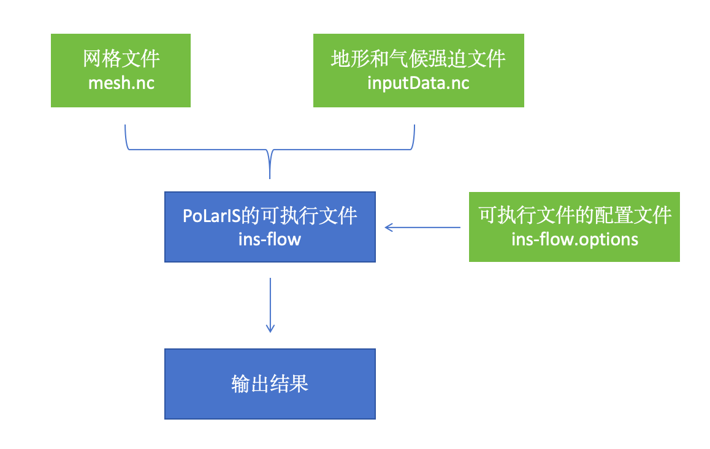<br><br>
   <b>图3.1：</b>PoLarIS模拟框架图。
</p>

PoLarIS的设计遵从Linux的KISS原则，即Keep It Simple and
Stupid。目标是想让零经验的同学都可以非常快的上手！
大型数值模拟经常让人望而却步的原因，其实并不完全是由于它们太复杂，而是让人看上去太复杂。想想微信或者PPT，这些软件要
复杂得多，但界面做的好、简单上手，人人都易用。而作为科研用途的数值模式，由于没有商业化，基本上是通过又当开发者又当研
究人员的科学家自己来维护，难以有时间和精力投入到“易用性”这一块，很容易导致一个局面：开发者自己用的风生水起，其他人用
的生不如死。为了避免出现这种情况，PoLarIS做了尽可能的简化：在编译好二进制文件`ins-flow`之后，只需要准备好3个文件，网
格文件、包含地形和气候强迫数据的输入文件和模式参数文件。

### 网格文件

PoLarIS基于有限元方法。有限元计算网格类型分结构网格和非结构网格，通俗的说就是均匀网格和不均匀网格。结构网格的
意思是每个网格大小都是“结构化”的，非结构网格的意思是不同区域网格形状和大小可以是不一样的，是“非结构化”的，
如图(<a href="#fig:6" data-reference-type="ref"
data-reference="fig:6">[fig:6]</a>,<a href="#fig:7" data-reference-type="ref"
data-reference="fig:7">[fig:7]</a>)。


 <div align="center">

<table>
<tr>
<td align="center">
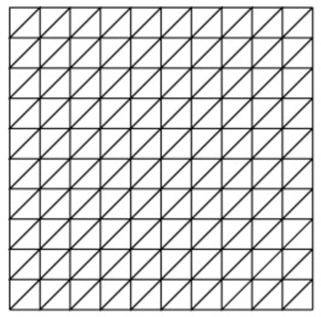<br>
<b>(a) 结构网格</b>
</td>

<td align="center">
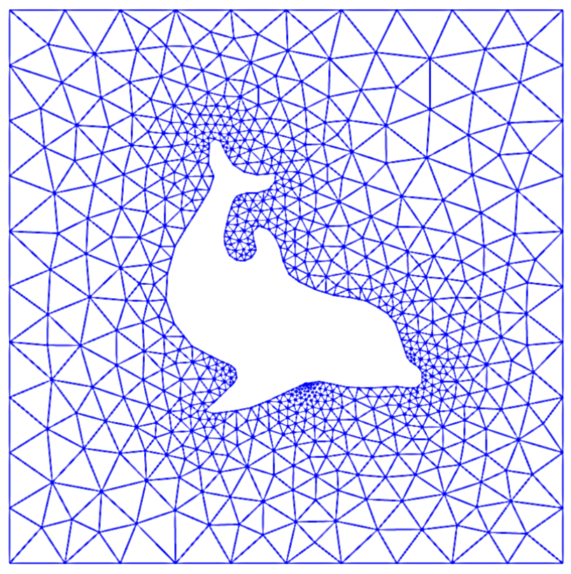<br>
<b>(b) 非结构网格</b>
</td>
</tr>
</table>

<b>图3.2：</b>结构网格和非结构网格

</div>


很显然，结构网格和非结构网格各有优缺点（表<a href="#table:2" data-reference-type="ref"
data-reference="table:2">3.1</a>）。PoLarIS同时支持结构网格和非结构网格。
选择不同的网格和我们想要模拟的区域和科学问题有关。以下是一个大致的分类：

<div id="table:2">

|  | 优点 | 缺点 |
|:--:|:---|:---|
| 结构网格 | 方便数据处理，网格简单，容易生成 | 难以对重点关注区域进行加密计算 |
| 非结构网格 | 可根据需求灵活加密或者粗放不同模拟区域 | 前后处理麻烦，网格难以生成，质量不高的网格对模拟计算有影响（比如难以收敛) |

结构网格和非结构网格的优缺点

</div>

- 想要模拟整条冰川、全南极、全格陵兰冰盖：结构网格

- 想要模拟冰盖的某一个流域：非结构网格

- 想要进行长时间和大空间尺度模拟（如古气候古冰盖）：结构网格

- 想要进行高精度的冰海耦合模拟：非结构网格

### 输入数据文件

在PoLarIS中，输入数据都放在一个`nc`文件里，包括模拟区域的地形数据、气候强迫数据底部滑动参数、冰
流速数据和地热通量数据等。目前，PoLarIS需要的数据见表(<a href="#table:3" data-reference-type="ref"
data-reference="table:3">3.2</a>)：在`nc`格式的数据文件中，数据名称需
要严格和第一列中的英文名一致，否则PoLarIS将认不出来我们所提供的数据。

<div id="table:3">

|  数据名   |     含义      |      单位       |     备注     |
|:---------:|:-------------:|:---------------:|:------------:|
|    bed    |   底床高程    |      $`m`$      |              |
| thickness |    冰厚度     |      $`m`$      |              |
|  surface  |   表面高程    |      $`m`$      |              |
|   temp    |   表面温度    |      $`K`$      |              |
| basalHeat |   地热通量    |  $`mW m^{-2}`$  |              |
|   beta2   | 底部摩擦系数  | $`Pa s m^{-1}`$ |              |
|   accu    |  表面积累率   |  $`m yr^{-1}`$  | 负值表示融化 |
|    ux     | 表面流速x分量 |  $`m yr^{-1}`$  |  仅反演需要  |
|    uy     | 表面流速y分量 |  $`m yr^{-1}`$  |  仅反演需要  |

输入数据文件

</div>

### 参数配置文件

在PoLarIS中，我们还可以很方便的通过一个后缀名为`.options`的配置文件来更改模式的设置，而不必去重新编译代码。
这和我们把网格和数据文件单独准备是一个道理：很多时候我们需要做一系列不同的数值试验，对于不同的试验，我们不必
去重新编译模式，而仅仅需要准备不同的输入文件和更改配置参数即可，方便性大幅提升的同时，也能大幅降低频繁修改
代码带来的误操作和不确定性。配置文件里有一些常用的参数（表(<a href="#table:4" data-reference-type="ref"
data-reference="table:4">3.3</a>)），需要了解一下.

<div id="table:4">

|    参数名    |     含义     |      选项       |      备注      |
|:------------:|:------------:|:---------------:|:--------------:|
|  mesh_file   |   网格文件   |    如mesh.nc    |                |
|  topo_file   | 输入数据文件 | 如inputData..nc |                |
|  core_type   |   动力框架   | stokes, fo, sia |   建议使用fo   |
|  use_slide   | 是否允许滑动 |      0, 1       |  0关闭，1启用  |
| sliding_law  |   滑动定律   |      1, 2       | 1线性，2非线性 |
|  solve_temp  | 是否计算温度 |      0, 1       |  0关闭，1启用  |
| solve_height | 是否更新高程 |      0, 1       |  0关闭，1启用  |
|      dt      |   积分步长   |      任意       | dt \< time_end |
|   time_end   |   模拟时间   |      任意       |                |

参数配置文件

</div>

好了，下面我们开始看具体的模拟案例。

### 一块悬停在斜坡上的冰

首先来看一个最简单的案例：有一块冰悬靠在一个斜坡上(<a href="#fig:8" data-reference-type="ref"
data-reference="fig:8">3.2</a>)。

<p align="center">
  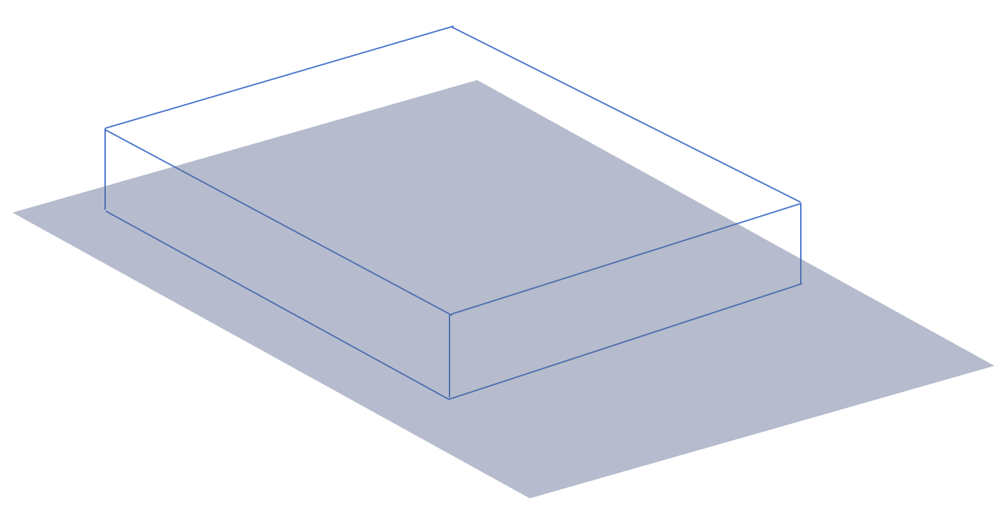<br><br>
   <b>图3.3：</b>一块悬停在斜坡上的冰。
</p>

这个冰块很巧合的正好是一个长方体的形状。冰块的厚度是$`100m`$，长度和宽度都是$`5000m`$，斜坡的坡度是$`0.1`$.
因为冰是流体，假设它的流动参数$`A`$是一个固定值$`1e-16`$，那么它在重力的作用下流动形成的流速场是什么呢？
为回答这个问题，我们需要模拟冰块的流动。

首先，我们要生成一个网格文件。
网格的长度和宽度和冰块大小一致，都是$`1000m`$，网格的空间分辨率是$`20m`$，那么它在$`x`$和$`y`$方向上都有51个格点。
在PoLarIS中，有一个固定的套路来生成网格文件。对于生成结构网格来说，非常的简单。在`ism-mesh`文件
夹中有和使用PoLarIS相关的一些脚本。在`scripts`文件夹中，可以看到一个名为`struct2d.c`的文件。
首先对其进行编译

```bash
$ gcc -o struct2d struct2d.c
```

这样，就生成了`struct2d`的可执行文件。`struct2d`接受6个参数，分别是

- `Lx`: 长方形在x方向上的长度

- `Ly`: 长方形在y方向上的长度

- `x0`: 区域左下角的x坐标

- `y0`: 区域左下角的y坐标

- `nx`: 在x方向有几个格点

- `ny`: 在y方向有几个格点

有了这6个参数，我们就可以得到任意长方形、任意空间分辨率的网格

```bash
$ ./struct2d Lx Ly x0 y0 nx ny
```

此处，我们将`Lx`和`Ly`设为$`5000m`$，`x0`和`y0`设为$`0`$，
`nx`和`ny`设为$`50`$，即x和y方向上总共有50格点，即dx和dy都是$`100m`$。

```bash
$ ./struct2d 5000 5000 0 0 50 50
```

运行这个命令会生成两个文件`box.node`和`box.elem`。随后，我们将用到网格生成软件
`triangle`,先下载安装`triangle`.

```bash
$ wget http://www.netlib.org/voronoi/triangle.zip
$ mkdir build
$ cd build
$ unzip ../triangle.zip
$ make
```

`make`后会得到`triangle`的二进制可执行文件。随后，将`triangle`拷贝到
和`box.node`和`box.elem`同一个文件夹下面（此处为`ism-mesh/scripts`），运行

```bash
$ ./triangle -rne box
```

运行结果会得到`box.1.node`, `box.1.elem`, `box.1.neigh`和
`box.1.edge`几个网格文件。这几个文件包括了网格在二维平面下的所有信息。我们可
以运行在`build`文件夹里的`showme`来看二维网格的情况：

```
$ ./build/showme box.1
```

接下来，我们需要将二维网格在$`z`$方向上扩展至三维，如下图


<p align="center">
  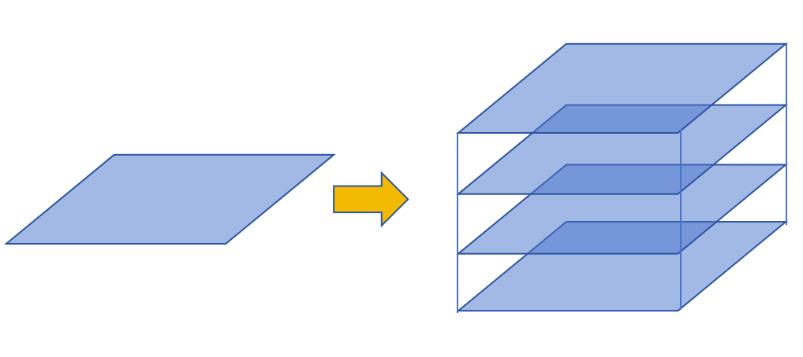<br><br>
   <b>图3.4：</b>扩展至三维。
</p>

我们将用到`scripts`里面的`triangle2prism.c`文件，编译命令为

```bash
$ gcc -o triangle2prism triangle2prism.c -lnetcdf
```

我们在`scripts`目录下面放了`netcdf-utils.h`，如果提示缺少
`netcdf-utils.h`，则在后面加上一个头文件路径

```bash
$ gcc -o triangle2prism triangle2prism.c -lnetcdf
-I/home/link/model/summerSchool2024/polaris/include/phg
```

`-I`后面跟着的就是`netcdf-utils.h`所在的路径。这个路径也可以用这条命令得到：

```bash
$ locate netcdf-utils.h
```

`locate`是一个第三方的软件，可以用`sudo apt install plocate`安装。
随后，运行

```bash

$ ./triangle2prism box.1 ../layers/layers5.N.dat
```

得到一个$`z`$坐标由`layers5.N.dat`定义的三维网格`mesh.nc`.
`layers5.N.dat`在`layers`文件夹中，是一个包含$`z`$坐标的简单文件(<a href="#table:5" data-reference-type="ref"
data-reference="table:5">3.4</a>).

<div id="table:5">

|              |
|:------------:|
|      5       |
| 0.000000e+00 |
| 7.818930e-02 |
| 1.875000e-01 |
| 3.469388e-01 |
| 5.925926e-01 |
| 1.000000e+00 |

layers5.N.dat

</div>

这是一个在$`z`$方向上分布不均匀的网格。冰底的坐标是0，表面坐标是1。当然，我们也可以选择一个在
$`z`$方向上均匀分布的文件，如`layers5.U.dat`。真实的$`z`$坐标会在PoLarIS读取地形数据之后自动生成。
生成的`mesh.nc`就是我们需要的网格文件。

其次，我们要准备输入数据文件。
输入数据我们统一放到一个`nc`文件里。对此我们也提供了示例的python程序，我们进
入`simpleGeo`文件夹，可以看到一
个`build_simple_geometry.py`文件。在这个文件里，可以很清楚地看到，我们是怎么样准备数
据坐标数据（x和y），
厚度（thickness）、底部地形（bed）和表面DEM（surface）数据的。此处厚度设为100m，坡度为0.1。
运行

```bash
$ python3 build_simple_geometry.py -o data.nc
```

即可得到目标的数据文件`data.nc`。这里可能会提示没有安装netCDF4包，那么就运行

```bash
$ pip3 install -i https://pypi.tuna.tsinghua.edu.cn/simple netCDF4
```

当然也可以不加`-o`选项，那么默认就会得到`out.nc`文件。
得到`data.nc`文件之后，就可以用`ncview`或者`nco`命令去查看，如

```bash
$ ncview data.nc
```

或者

```bash
$ ncdump -h data.nc
```

如果没有，在ubuntu上面也是很容易安装的

```bash
$ sudo apt install ncview
```
```bash
$ sudo apt install nco netcdf-bin
 ```


现在我们有了网格文件和输入数据文件，可以进行模拟了。在`simpleGeo`文件
夹里，我们把之前编译好的PoLarIS二进制文件`ins-flow`、网格文件`mesh.nc`和
输入数据`data.nc`一起拷过来。

```bash
$ cp PATH/TO/ins-flow PATH/TO/simpleGeo
```
```bash
$ cp PATH/TO/mesh.nc PATH/TO/simpleGeo
 ```
```bash
$ cp PATH/TO/data.nc PATH/TO/simpleGeo
```


在`simpleGeo`目录中，有`ins-flow.options`、
`T.asm.options`、`fo.asm.options`和`stokes.asm.options`几个文
件。其中，`ins-flow.options`是我们模拟的配置文件，其他几个`asm.options`文件
是和求解器相关的配置文件，一般情况下不需要改动。我们需要改的是`ins-flow.options`
文件，把其中的几个选项改一下(<a href="#table:6" data-reference-type="ref"
data-reference="table:6">3.5</a>)：

<div id="table:6">

| -mesh_file mesh.nc |              网格文件               |
|:------------------:|:-----------------------------------:|
| -topo_file data.nc |              数据文件               |
| -constant_A 1e-16  | 不模拟温度，假定一个固定的流动系数A |
|    +solve_temp     |           关掉温度求解器            |
|     +use_slide     |             底部不滑动              |
|   +solve_height    |          关掉冰面高程计算           |
|  -max_time_step 1  |            最大时间步1年            |
|       -dt 1        |              时间步1年              |
|    -time_end 1     |             最终时间1年             |

ins-flow.options


最后创建三个新的文件夹，用来存放输出结果和可能的错误和记录文件。

```bash

$ mkdir output
$ mkdir log
$ mkdir error
```


我们就可以运行了

```bash
$ mpirun -n 4 ./ins-flow
```

这条命令的意思是用4个核并行运行PoLarIS。经过十几步迭代计算，我们就可以在`output`文件夹里查看
到输出的`vtk`文件了。可以用`paraview`查看.

```bash

$ paraview output/ice_00001.vtk
```

### 珠峰东绒布冰川

ISMIP-HOM Benchmark实验

1.生成ISMIP-HOM网格

```bash
cd Summer/ism-mesh/ISMIP-HOM
source batch.sh
```

产生`mesh.nc`,`testA.nc`,`testC.nc`.

2.进行ISMIP-HOM实验

```bash
cd Summer/phgism/ice-sheet/ISMIP-HOM
```

创建输出文件夹（注意：缺失这些文件夹会出错！）

```bash
mkdir -p ouptut log err
```

拷贝网格和数据文件

```bash
cp Summer/ism-mesh/ISMIP-HOM/*.nc .
```

测试A 修改配置文件`ins-flow.options`, 用 `“-topo_file testA.nc”`

```bash
$ mpirun -np 4 ./ins-flow`\
-options_file stokes.asm.options -max_non_step0 2
```

测试C 修改配置文件 `ins-flow.options`, 用 `“-topo_file testC.nc”`

```bash
$ mpirun -np 4 ./ins-flow`\
-options_file stokes.asm.options -use_slide -max_non_step0 2`
```

3.查看结果 使用`paraview`打开`output/ice_00001.vtk`查看。
